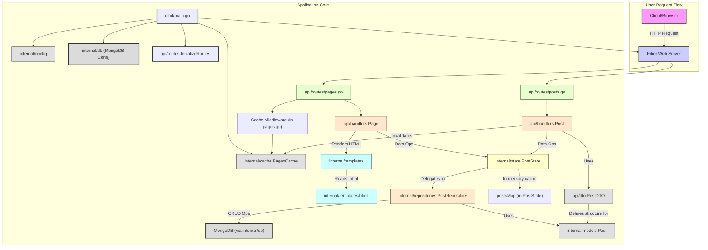

# Newsteller Project

This project is a news teller application built with Go.

## Prerequisites

- Docker
- Go (version 1.24.2 or higher)
- Make (optional, for using Makefile commands)

## How to Run

1.  **Clone the repository:**
    ```bash
    git clone https://github.com/vanyatemno/newsteller
    cd newsteller
    ```
2.  **Set up environment variables:**
    Create a `.env` file in the root directory by copying the example or using your own configuration. This file should contain variables like `MONGO_INITDB_ROOT_USERNAME`, `MONGO_INITDB_ROOT_PASSWORD`, `MONGO_INITDB_DATABASE`, and `PORT`.
3.  **Run the application:**
    You can use either Docker Compose (recommended) or run the Go application directly.

    *   **Using Docker Compose (recommended):**
        ```bash
        make run
        ```
        Alternatively, you can run:
        ```bash
        docker compose up --build
        ```
        This will start the Go backend, MongoDB database, and Mongo Express.
        - The application will be accessible at `http://localhost:${PORT}` (refer to your `.env` file for the `PORT` value).
        - Mongo Express will be accessible at `http://localhost:8081`.

    *   **Running Go application directly (for development):**
        Ensure you have a running MongoDB instance accessible to the application.
        ```bash
        go run cmd/main.go
        ```

## How to Test

To run the tests for the internal packages, use the following command:

```bash
make test
```
Alternatively, you can run:
```bash
go test ./internal/*
```

## Technologies and Libraries

The project utilizes the following main technologies and libraries:

*   **Go:** The primary programming language for the backend.
*   **Docker & Docker Compose:** For containerization and orchestration of services (MongoDB, Go backend, Mongo Express).
*   **MongoDB:** NoSQL database used for storing application data.
    *   `mongo-driver`: Official Go driver for MongoDB.
*   **Fiber:** A Go web framework inspired by Express.js.
*   **Viper:** For configuration management (e.g., reading from `.env` files).
*   **Godotenv:** For loading environment variables from a `.env` file.
*   **Zap:** For structured, leveled logging.
*   **Testify:** For Go testing assertions.
*   **Validator v10:** For data validation.
*   **Dockertest:** For integration testing with Docker containers.
*   **Xsync:** For concurrent data structures.

## Project Structure

The project is organized into the following main directories:

*   **`/api`**: Contains the API layer, including:
    *   **`/api/dto`**: Data Transfer Objects used for API requests and responses.
    *   **`/api/handlers`**: HTTP request handlers for different routes.
    *   **`/api/routes`**: Definitions of API routes and their corresponding handlers.
*   **`/cmd`**: Contains the main application entry point.
    *   **`/cmd/main.go`**: Initializes and starts the application.
*   **`/deploy`**: Contains deployment-related files.
    *   **`/deploy/docker`**: Docker-related configurations.
        *   **`/deploy/docker/backend/Dockerfile`**: Dockerfile for building the Go backend image.
        *   **`/deploy/docker/database/.env`**: Environment variables specific to the database container (though typically managed by the main `.env` and `docker-compose.yml`).
*   **`/internal`**: Contains the core business logic and internal workings of the application. This code is not intended to be imported by other projects.
    *   **`/internal/cache`**: Caching mechanisms (details inferred from `cache/rotues.go`, likely route caching).
    *   **`/internal/config`**: Configuration loading and management.
    *   **`/internal/db`**: Database connection and interaction logic.
    *   **`/internal/models`**: Data models representing application entities (e.g., `Post`).
    *   **`/internal/repositories`**: Data access layer, responsible for interacting with the database.
    *   **`/internal/state`**: Application state management (e.g., managing posts).
    *   **`/internal/templates`**: HTML template rendering logic.
        *   **`/internal/templates/html`**: Contains the actual HTML template files.
*   **`.env`**: Environment variables file (not committed to Git, should be created locally).
*   **`docker-compose.yml`**: Defines the services, networks, and volumes for the Dockerized application.
*   **`go.mod` & `go.sum`**: Go module files defining project dependencies.
*   **`Makefile`**: Contains helper commands for common tasks like running and testing the application.

## Project Interfaces and Flow

The following diagram illustrates the high-level interaction between the main components of the Newsteller application:




**Explanation of Flow:**

1.  A **User/Client** (e.g., a web browser) sends an HTTP request to the **Go Backend API**.
2.  The **Go Backend**, built with Fiber, receives the request.
    *   **API Routes** (`/api/routes`) direct the request to the appropriate **API Handlers** (`/api/handlers`).
    *   **API Handlers** process the request. They may use:
        *   **DTOs** (`/api/dto`) to validate and structure request/response data.
        *   **Repositories** (`/internal/repositories`) to interact with the database. Repositories use **Models** (`/internal/models`) to represent data and the **DB Connection** (`/internal/db`) logic to communicate with **MongoDB**.
        *   **Application State** (`/internal/state`) for managing application-wide data or status.
        *   **Template Engine** (`/internal/templates`) to render HTML pages using **HTML Files** (`/internal/templates/html`) which are then sent back to the user.
    *   **Configuration** (`/internal/config`, using Viper and `.env`) provides settings for the application.
    *   **Logging** (using Zap) records application events.
3.  **MongoDB** stores and retrieves application data.
4.  **Mongo Express** provides a web-based UI for administering the MongoDB database, accessible separately.
5.  All services (Backend, MongoDB, Mongo Express) are managed by **Docker Compose**.

This structure promotes separation of concerns, making the application more modular and maintainable.
